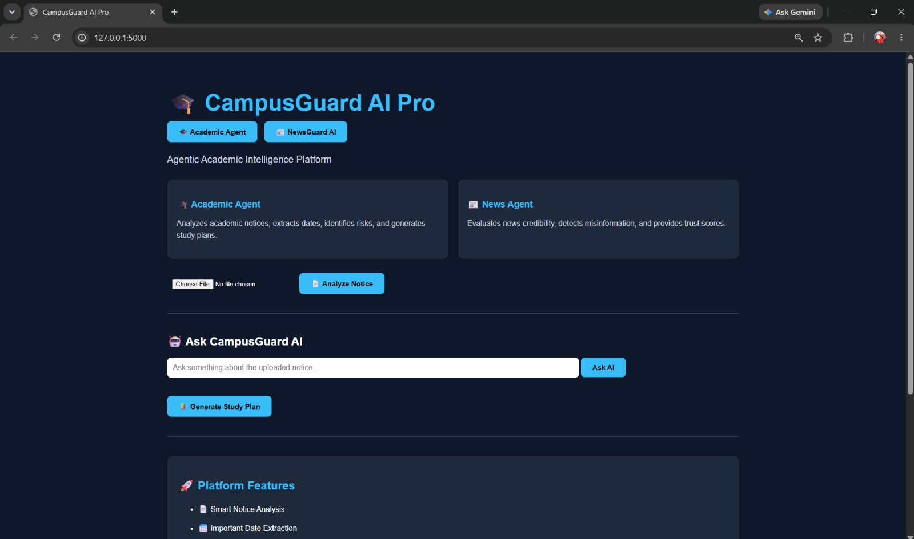
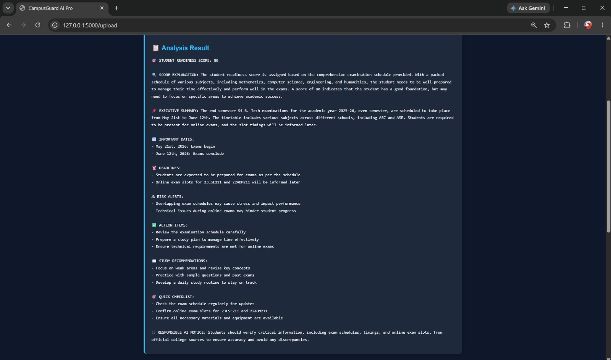
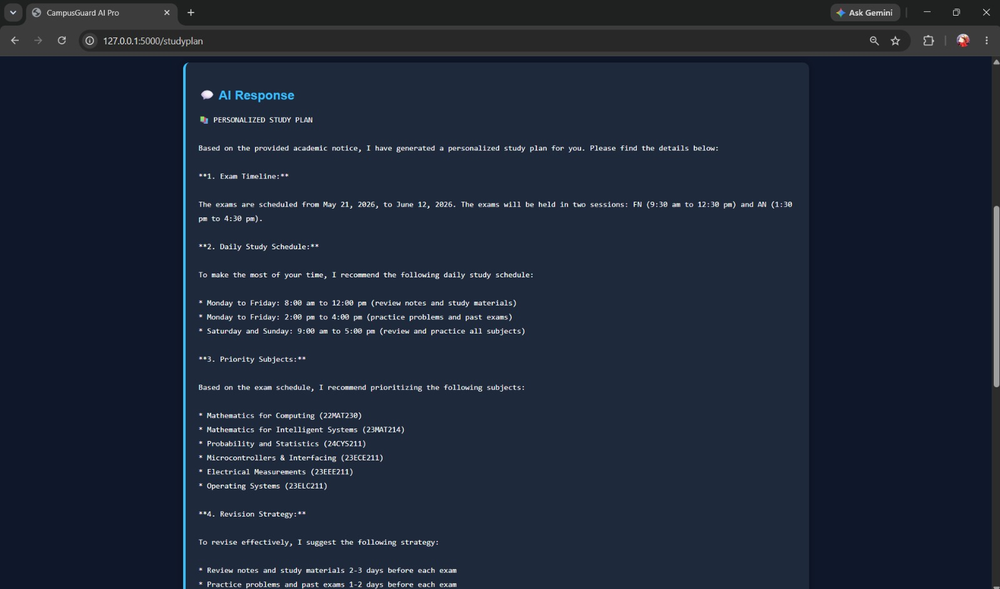
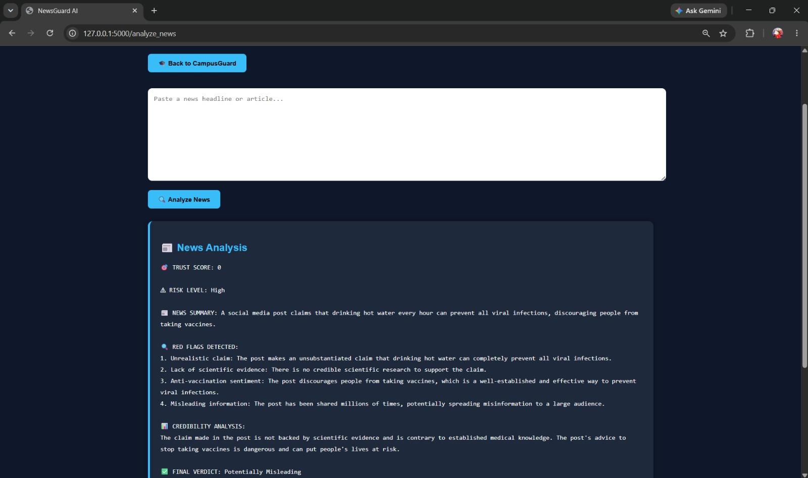
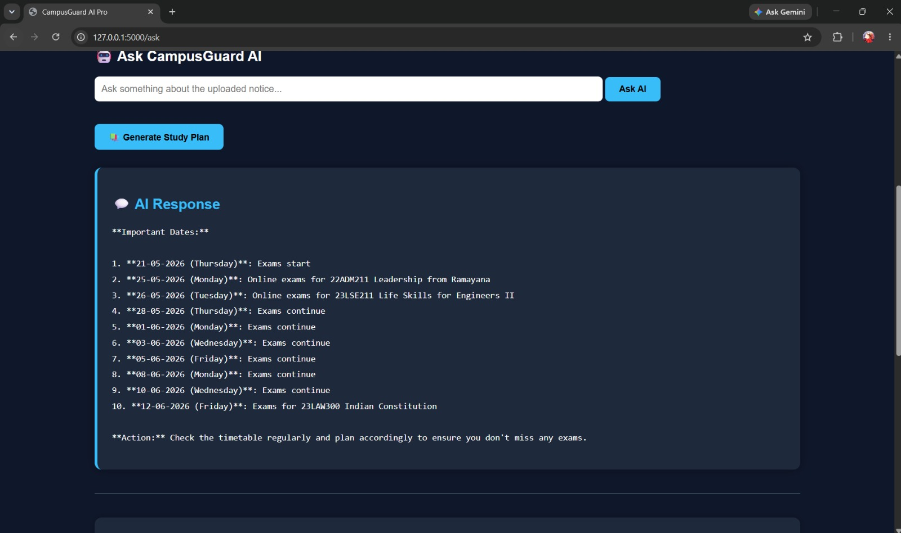

# 🎓 CampusGuard AI Pro

## AI-Powered Multi-Agent Platform for Academic Assistance and News Verification

CampusGuard AI Pro is an intelligent multi-agent platform designed to help students manage academic information, improve productivity, and identify potentially misleading information through responsible AI.

---

# 📌 Overview

CampusGuard AI Pro combines two specialized AI agents into a single student-focused platform.

The system helps students understand academic notices, identify important deadlines, generate study plans, answer academic queries, and evaluate the credibility of news content.

By combining educational assistance with misinformation detection, CampusGuard AI Pro promotes informed decision-making and responsible AI usage.

## 🎓 Academic Agent

Helps students analyze academic notices and stay organized by:

* Extracting important dates
* Identifying deadlines
* Detecting risks
* Generating action items
* Answering academic questions
* Creating personalized study plans

## 📰 NewsGuard AI

Analyzes news articles and headlines by:

* Detecting misleading information
* Assigning trust scores
* Identifying red flags
* Providing fact-check recommendations
* Suggesting reliable verification sources

---

# 🚀 Features

## Academic Agent

* 📄 Smart Notice Analysis
* 📅 Important Date Extraction
* ⚠ Risk Alert Detection
* 🎯 Student Readiness Score
* ✅ Action Item Generation
* 🤖 AI Academic Question Answering
* 📚 Personalized Study Planner
* 📖 Study Recommendations

## NewsGuard AI

* 📰 News Credibility Analysis
* 🎯 Trust Score Generation
* ⚠ Risk Level Detection
* 🔍 Red Flag Identification
* ✅ Final Verdict Classification
* 📌 Fact-Check Recommendations
* 🌐 Reliable Verification Sources

---

# 🌍 Real-World Impact

### Educational Support

Helps students quickly understand lengthy academic notices and institutional announcements.

### Time Management

Automatically extracts deadlines and generates personalized study plans.

### Information Verification

Assists users in identifying potentially misleading or suspicious news content.

### Responsible AI Usage

Encourages fact-checking and critical thinking instead of blindly trusting AI-generated outputs.

---

# 🛡 Responsible AI

CampusGuard AI Pro follows responsible AI principles.

### Transparency

The platform explains why a notice or news article is flagged and provides supporting reasoning.

### Human-in-the-Loop

AI-generated recommendations are intended to assist users and should not replace human judgment.

### Privacy Awareness

Uploaded academic notices are processed only for analysis purposes.

### Trustworthy Information

NewsGuard AI encourages users to verify information through reliable sources before making decisions.

### AI Disclaimer

AI-generated outputs may contain inaccuracies and should always be independently verified.

---

# 🛠 Technology Stack

## Frontend

* HTML
* CSS

## Backend

* Python
* Flask

## AI Model

* Groq API
* Llama 3.3 70B Versatile

## PDF Processing

* PyPDF

---

# 📂 Project Structure

```text
CampusGuard-AI-Pro/
│
├── app.py
├── requirements.txt
├── README.md
├── .gitignore
│
├── static/
│   └── style.css
│
├── templates/
│   ├── index.html
│   └── news.html
│
├── screenshots/
│   ├── home.jpeg
│   ├── analysis.jpeg
│   ├── study_plan_result.jpeg
│   ├── NewsGuardResult.jpeg
│   └── ask_ai.jpeg
│
└── uploads/
```

---

# 📸 Screenshots

## 🏠 Home Dashboard



## 📄 Academic Notice Analysis



## 📚 Personalized Study Plan



## 📰 NewsGuard AI



## 🤖 AI Academic Assistant



---

# ⚙️ Installation

## Clone Repository

```bash
git clone https://github.com/Syedabdulazeez-021/CampusGuard-AI-Pro.git
cd CampusGuard-AI-Pro
```

## Install Dependencies

```bash
pip install -r requirements.txt
```

## Create Environment File

```env
GROQ_API_KEY=your_api_key_here
```

## Run Application

```bash
python app.py
```

Open:

```text
http://127.0.0.1:5000
```

---

# 🎯 Use Cases

## Academic Notice Analysis

Upload a college notice PDF and receive:

* Notice Summary
* Important Dates
* Deadlines
* Risk Alerts
* Action Items
* Readiness Score

## AI Academic Assistant

Ask questions directly about uploaded notices.

Examples:

* When is the exam?
* What documents are required?
* What are the deadlines?

## Personalized Study Planning

Generate AI-powered study plans based on notice content and exam schedules.

## News Verification

Paste any headline or article and receive:

* Trust Score
* Risk Analysis
* Credibility Assessment
* Fact-Check Recommendations
* Reliable Sources

---

# 🎯 Mozilla.ai Alignment

CampusGuard AI Pro aligns with Mozilla.ai principles by promoting:

* Trustworthy AI systems
* Educational empowerment
* Explainable AI outputs
* Human-centered decision support
* Responsible information verification
* Transparency in AI-generated recommendations

The platform helps users make informed decisions rather than replacing human judgment.

---

# 🔮 Future Enhancements

* OCR Support for Image Notices
* Calendar Integration
* Email Notifications
* Multi-Language Support
* Real-Time Fact Verification APIs
* Mobile Application
* User Authentication
* Cloud Deployment

---

# 👨‍💻 Developer

**Abdul Azeez Syed**

AI-Powered Student Productivity & Information Verification Platform

---

# ⭐ Built With

* Flask
* Python
* Groq API
* Llama 3.3 70B
* HTML
* CSS
